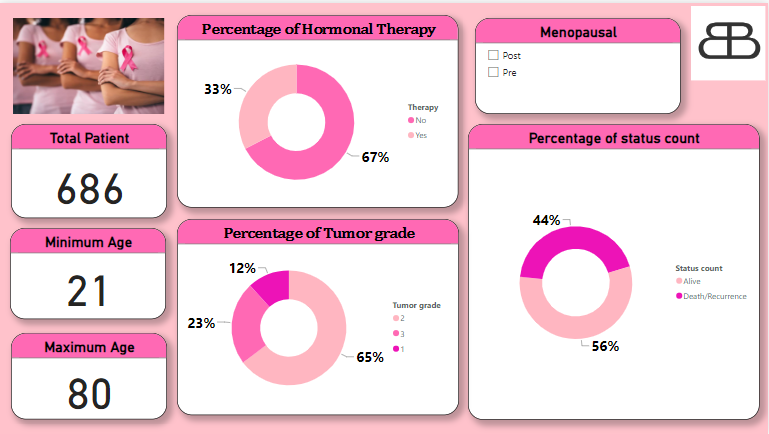
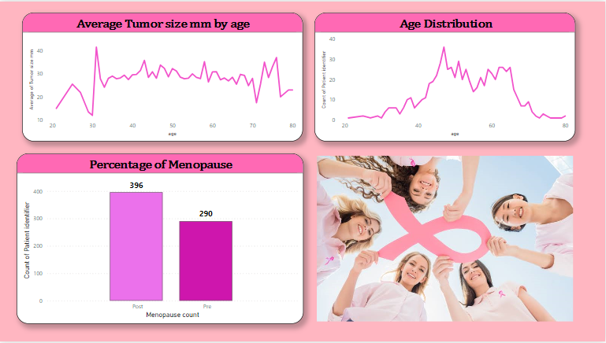
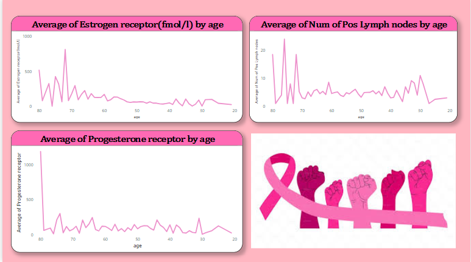

# Data-Dynamos-Project

## PROJECT TOPIC: BREAST CANCER AND FIGHT FOR SURVIVAL

### PROJECT OUTLINE
- [INTRODUCTION](#INTRODUCTION)
- [AIMS AND OBJECTIVES](#AIMS-AND-OBJECTIVES)
- [DETAILED FINDINGS](#DETAILED-FINDINGS)
- [INSIGHT](#INSIGHT)
- [VISUAL REPORT](#VISUAL-REPORT)
- [CONCLUSION](#CONCLUSION)
- [RECOMMENDATION](#RECOMMENDATION)
---

#### INTRODUCTION
Breast cancer is one of the most prevalent cancers among women globally and is the second most common cancer overall. This study illustrates trials conducted by the German Breast Cancer Study Group (GBSG) from 1984 to 1989, focusing on patients with node-positive breast cancer.
---

#### AIMS AND OBJECTIVE
1. Analyze the Distribution of Tumor Grades: To determine the percentage distribution of tumor grades among the patients.
2. Insights into Patient Outcomes by Age Groups: To provide insights into how various age groups fare and identify critical risk factors affecting patient outcomes.
3. Evaluate Positive Lymph Node Rates by Age: To assess the rate of positive lymph nodes across different age groups.
4. Correlate Age Distribution: To analyze the age distribution among the patients.
5. Relationships Between Hormone Receptors and Age: To explore the relationships between average progesterone and estrogen receptor levels by age.
6. Analyze Tumor Size by Age: To assess the distribution of tumor sizes across different age groups.
---

#### DETAILED FINDINGS:

##### Tumor Grade Distribution
- Grade 1: 12%
- Grade 2: 65%
- Grade 3: 23%

This distribution indicates that the majority of patients (65%) had a Grade 2 tumor, followed by 23% with Grade 3 and 12% with Grade 1.

##### Hormonal Therapy
- No Hormonal Therapy: 67%
- Yes to Hormonal Therapy: 33%

The data shows that two-thirds of the patients did not receive hormonal therapy, while one-third did.

##### Status Count (Alive Without Recurrence or Dead/Recurrence)
- Dead/Recurrence: 44%
- Alive Without Recurrence: 56%

The status count indicates that slightly more than half of the patients (56%) were alive without recurrence, while 44% experienced recurrence or died.

##### Menopausal Status
- Premenopausal: 42%
- Postmenopausal: 58%

The menopausal status data shows that a larger proportion of patients (58%) were postmenopausal, with 42% being premenopausal.

##### Age Distribution
- The majority of women were concentrated between ages 43-65, with the highest percentage at age 47 (36 women).

##### Positive Lymph Nodes by Age
- A line chart shows that women at age 76 had the highest number of positive lymph nodes. There is a trend of increasing positive lymph nodes with age.

##### Estrogen Receptors by Age
- A line chart shows that older women (ages 69-80) have higher estrogen receptor levels on cancer cells compared to younger women.

##### Progesterone Receptors by Age
- A line chart indicates that women at age 80 have the highest levels of progesterone receptor distribution.

##### Tumor Size by Age
- A line chart shows that women at age 31 had the highest tumor size (41.5mm).

---

#### INSIGHTS
- The majority of tumors were Grade 2.
- Most patients did not receive hormonal therapy.
- Over half of the patients were alive without recurrence.
- A higher percentage of patients were postmenopausal.
- The age distribution was concentrated between 43-65 years, with a peak at 47 years.
- Positive lymph nodes increased with age, peaking at 76 years.
- Older women (69-80 years) had higher estrogen receptor levels.
- Progesterone receptor levels were highest at age 80.
- The largest tumor size was observed at age 31.
---
#### VISUAL Report

---
#### RECOMMENDATION

Based on what we've learned, it's important for younger women to get regular check-ups. For older women, it's important to have more thorough screenings and treatments tailored to their specific hormone levels to improve their chances of recovery.
---

#### CONCLUSION

These insights help identify patterns associated with breast cancer in different age groups.

# REPORT

I had one of the best weeks of my life at the just concluded future boot camp by incubator nigeria and RCCG, I would say that i have never experienced anything like, Kudos you to you guys.

